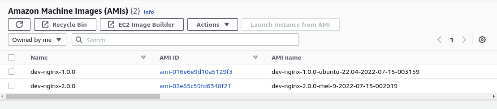

# AWS

## Certifique-se das variáveis para autenticação
- AWS_ACCESS_KEY_ID
- AWS_SECRET_ACCESS_KEY

## Criar uma AMI personalizada

1. Criando VPC e Subnet (opcional)
```
cd aws/terraform/
terraform init
terraform validate
terraform apply -auto-approve
```

2. Construindo AMI (edite as variáveis antes de buildar)
```
cd ../packer/
cp variables.auto.pkrvars.hcl.example variables.auto.pkrvars.hcl
packer validate .
packer build .
```

## Variáveis
| Nome            | Exemplo                         | Descrição |
| --------------- | ------------------------------- | --------- |
| region          | sa-east-1                       | Região onde os recursos serão provisionados |
| environment     | prod/pre-prod/homol/dev         | Estágio da AMI  |
| ami_name        | nginx                           | Identificação da AMI |
| ami_version     | 1.0.0                           | Versão da AMI |
| ami_description | simple nginx                    | Descrição da AMI |
| instance_type   | t2.micro                        | Fámilia da instância |
| source_ami      | debian-11/ubuntu-22.04/rhel-9   | Sistema operacional |
| vpc_name        | learn-vpc                       | Nome da VPC que a AMI será criada |
| subnet_name     | learn-subnet-public1-sa-east-1a | Nome da Subnet que a AMI será criada |

## AMI criada

